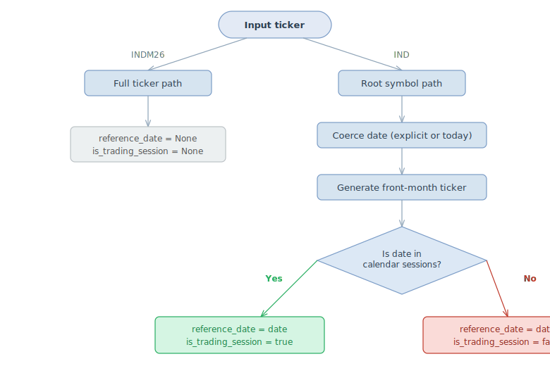

# Smart Ticker Parsing

## Summary

Both the Python (`tickerforge-py`) and Rust (`tickerforge-rs`) implementations now support **smart ticker parsing**: the parser accepts either a **full ticker** or a **root symbol**.

This is a parsing-layer feature that relies on the contract data defined in this spec (symbol, `ticker_format`, contract cycles) but does not change any spec YAML files.

## Behaviour

### Full ticker (e.g. `INDM26`)

The parser matches the input against every contract's `ticker_format` pattern. Year and month are extracted directly:

- **Month** from the standard futures month code.
- **Year** from `2000 + yy`.

No reference date is required — the ticker is self-describing.

### Root symbol (e.g. `IND`)

When the input does not match a `ticker_format` but does match a known `symbol` key in the contracts map, the parser resolves the front-month contract for the given (or today's) reference date, then parses the resulting full ticker.

### Spec fields used

| Field | Role |
|---|---|
| `symbol` | Identifies root symbols for fallback resolution |
| `ticker_format` | Regex pattern source for full-ticker matching |
| `contract_cycle` | Validates that the decoded month is valid for this contract |
| `tick_size` | Propagated to `ParsedTicker.tick_size` |
| `contract_multiplier` | Propagated to `ParsedTicker.lot_size` |
| `exchange` | Used to look up the exchange calendar for `is_trading_session` |

### `is_trading_session` and `reference_date`

When parsing a **root symbol**, the result includes:

- `reference_date` — the date (explicit or today) used to resolve the front-month contract.
- `is_trading_session` — whether that date is an actual trading session on the contract's exchange calendar.

Both fields are `None` when a **full ticker** is parsed (no date context).

## Builder pattern

Both implementations provide a `TickerParser.builder()` fluent API with two terminal methods:

- `build()` — returns a reusable parser
- `parse()` — one-shot: loads spec + parses a ticker in one call

Builder options: `spec_path`, `ticker`, `reference_date`.

The Rust builder uses **typestate generics** (`NoTicker` / `HasTicker`) to enforce at compile time that `parse()` is only available after `ticker()` has been called.  The Python builder enforces the same constraint at runtime (no `parse` attribute without `ticker`).

## Implementation references

- **Python**: `tickerforge-py/tickerforge/ticker_parser.py` — `_parse_full_ticker`, `_resolve_root_symbol`, `parse_ticker`, `TickerParser.builder()`
- **Rust**: `tickerforge-rs/src/ticker_parser.rs` — `try_parse_full_ticker`, `try_resolve_root_symbol`, `parse_ticker`, `parse_ticker_date`, `parse_ticker_spec`, `parse_ticker_date_spec`, `TickerParserBuilder<T>`

See each project's `docs/smart-ticker-parsing.md` for language-specific API details.
